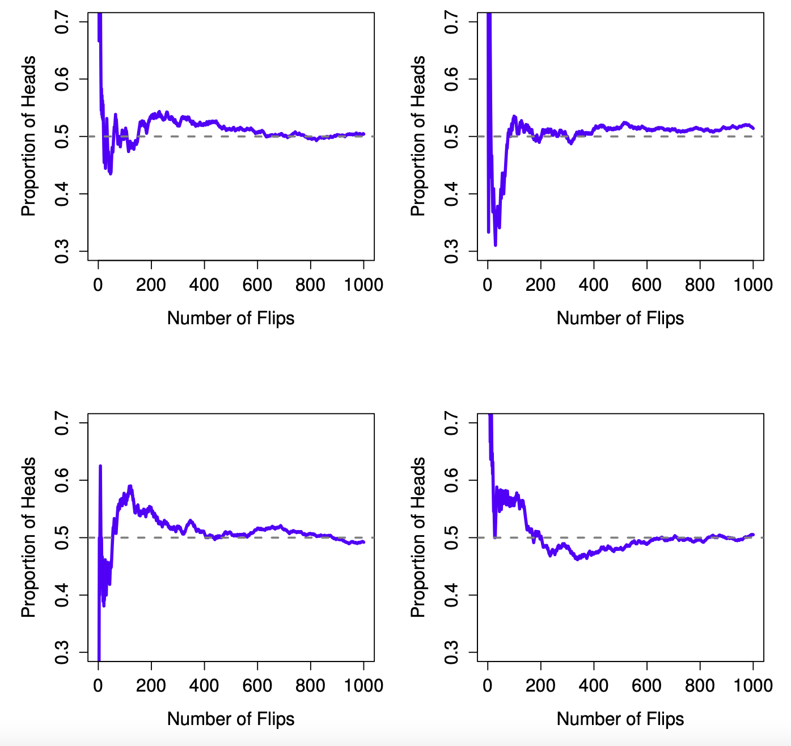
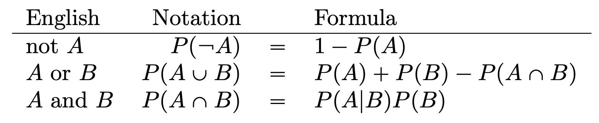

So far we have discussed about descriptive statistics - summarizing data and plotting it. But in order gain the power of making inferences, we will be strating with inferential statistics.

#### Pre-requisite: Probability

##### Difference between probability and statistics**
Probability theory is a branch of mathematics that tells you how often different kinds of events will happen. For eg. What are the chances of a fair coin coming up heads 10 times in a row? or What are the chances that I’ll win the lottery?

In each case the “truth of the world” is known. We know that the coin is fair, so there’s a 50% chance that any individual coin flip will come up heads. We know that the lottery follows specific rules. The critical point is that probabilistic questions start with a known model of the world, and we use that model to do some calculations. *[Chapter 9, Navarro D.]*

- - - -
**A short note on Models**

A model is a simplified representation of a system. For example, the map of a city represents a city in a simplified fashion. A map providing as much detail as the original city would not only be impossible to construct, it would also be pointless. Humans build models, such as maps and statistical models, to make their lives simpler. *[Chapter 3, Winter B.]*
- - - -

But even though we know the models like `P(heads) = 0.5`, we do not know the data (Whetehr heads will come 10 times or 3 times). However, for statistics, it is the opposite. We have the data and we want to infer the truth about the world. For eg., If my friend flips a coin 10 times and gets 10 heads, are they playing a trick on me? or If the lottery commissioner’s spouse wins the lottery, how likely is it that the lottery was rigged?

We want to figure out which is the true model of the world. Is it *P(heads) = 0.5* or is it *P(heads) $\ne$ 0.5*?

##### What is probability really?

**The frequentist view**



According to the frequentist view, flip a fair coin over and over again, and as N grows large (approaches infinity, denoted N Ñ 8), the proportion of heads will converge to 50%.

 *Advantages*
 -  It is objective: the probability of an event is necessarily grounded in the world.
 -  It is unambiguous: any two people watching the same sequence of events unfold, trying to calculate the probability of an event, must inevitably come up with the same answer.

But it all depends on infinite flips of coin. Do infinities really exist in the physical universe? What about the probability for a single non-repeatable event like the chances of rain on 21 September 2021?

**The Bayesian view**

Bayesian view is subjectivist view. The most common way of thinking about subjective probability is to define the probability of an event as the degree of belief that an intelligent and rational agent assigns to that truth of that event. But how to operationalize this 'degree of belief'? 

One way is to use 'rational gambling'. So a “subjective probability” will be operationalized in terms of what bets you're willing to accept.

 *Advantage*
 - You don’t need to be limited to those events that are repeatable.
 
 *Disadvantage*
 - Can’t be purely objective – specifying a probability requires us to specify an entity that has the relevant degree of belief. This entity might be a human, an alien, a robot, or even a statistician, but there has to be an **intelligent agent** out there that believes in things. 


In short, frequentist view is sometimes considered to be too narrow (forbids lots of things that that we want to assign probabilities to) while the Bayesian view is sometimes thought to be too broad (allows too many differences between observers).

##### Definitions

Refer to the example described in *Section 9.3.1, Navarro D.* for the following content.

**Elementary event:** Every time we make an observation (e.g., every time I put on a pair of pants), then the outcome will be one and only one of these events.

**Sample space:** The set of all possible events (e.g., the wardrobe)

**Probability:** Numbers between 0 and 1.

For an event X, the probability of that event P(X) is a number that lies between 0 and 1. The bigger the value of P(X), the more likely the event is to occur.

If P(X) = 0, it means the event X is impossible (i.e., I never wear those pants). On the other hand, if P(X)= 1 it means that event X is certain to occur (i.e., I always wear those pants).

**Law of total probability:** The probabilities of the elementary events need to add up to 1

#### Distributions

Let's take a look at this and see what is a distribution. 

```{r}
pants <- data.frame(
   type = c("Blue jeans","Grey jeans","Black jeans","Black suit","Blue tracksuit"),
   label = c("X1", "X2", "X3", "X4", "X5"),
   probability = c(0.5,0.3,0.1,0,0.1))

pants
```
Probability distribution is simply the probabilities of these different events above. Each of the events has a probability that lies between 0 and 1, and if we add up the probability of all events, they sum to 1.

```{r}
#Try plotting a bar graph of all the probabilities above
```
Let's think about what happens in case of non-elementary events. E.g. An event E where either “blue jeans” or “black jeans” or “grey jeans" has occurred. 
Then what will be the probability of event E.

P(E) = P(X1) + P(X2) + P(X3)

If any of these elementary events occurs, then E is also said to have occurred. Similarly, there are other rules satisfying probabilities:



##### Binomial Distribution

*Refer to section 9.4.1, Navarro D., for the detailed example*

Some basic terminology - We’ll let `N` denote the number of dice rolls in our experiment; which is often referred to as the `size parameter` of our binomial distribution. We’ll also use `θ` to refer to the the probability that a single die comes up skulls, a quantity that is usually called the `success probability` of the binomial. Finally, we’ll use `X` to refer to the results of our experiment, namely the number of skulls I get when I roll the dice. Since the actual value of X is due to chance, we refer to it as a `random variable`.

`X ~ Binomial(θ, N)` denotes X is generated randomly from a binomial distribution with parameters θ and N.

Let's generate a binomial distribution in R:

```{r}
dbinom( n = 4, size = 20, prob = 1/6 )
```
The above command calculates the probability of getting x = 4 skulls, from an experiment of size = 20 trials, in which the probability of getting a skull on any one trial is prob = 1/6.

What if the dice is replaced by a coin in the above example? How will the probability change? 

```{r}
#Try finding the probability for N = 20 and N=100 trials for a fair coin flip.
```
There are different functions in R for different distributions as well as different ones for finding different quantity of interest.

If we want to find the probability of obtaining an outcome smaller than or equal to quantile q, then we can directly use `pbinom`.

```{r}
#Find the probability of rolling 0 skulls or 1 skull or 2 skulls or 3 skulls or 4 skulls
pbinom( q= 4, size = 20, prob = 1/6)

#Practice - Find probability of getting 0-5 heads in 50 trials of coin flip
```
In other words, value of 4 is actually the 76.9th percentile of this binomial distribution.

Now let’s say we want to calculate the 75th percentile of the binomial distribution.

```{r}
qbinom( p = 0.75, size = 20, prob = 1/6 )

#Practice - Find the 40th percentile
```

We've found different quantities. What if we want to simulate the above experiments. We specify how many times R should “simulate” the experiment using the n argument, and it will generate random outcomes from the binomial distribution using the `rbinom` function.

```{r}
z <- rbinom( n = 100, size = 20, prob = 1/6 )
z
#Let's also plot this and see how it looks
hist(z, col = 'steelblue')
```
#Try plotting the distributions in above examples and vary the size, trial number and probability to generate different plots.

All these different functions *d, p, q, n* are also applicable to other distributions. E.g. *dnorm, pnorm, qnorm, rnorm* for Normal distribution. 

End of part 1
